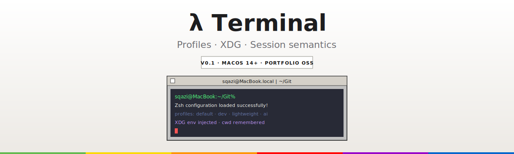
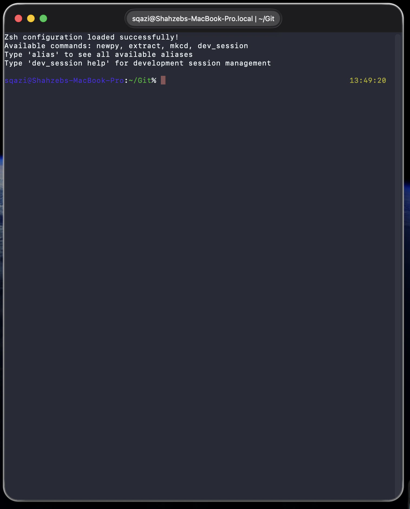
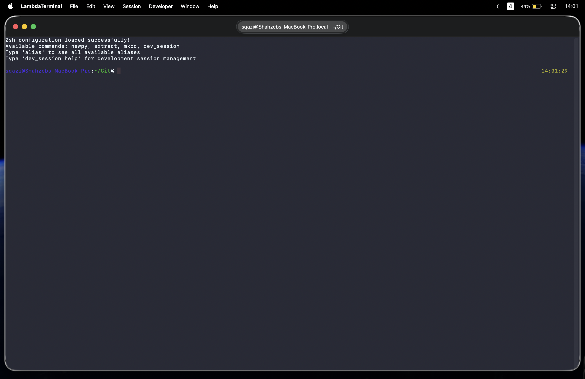
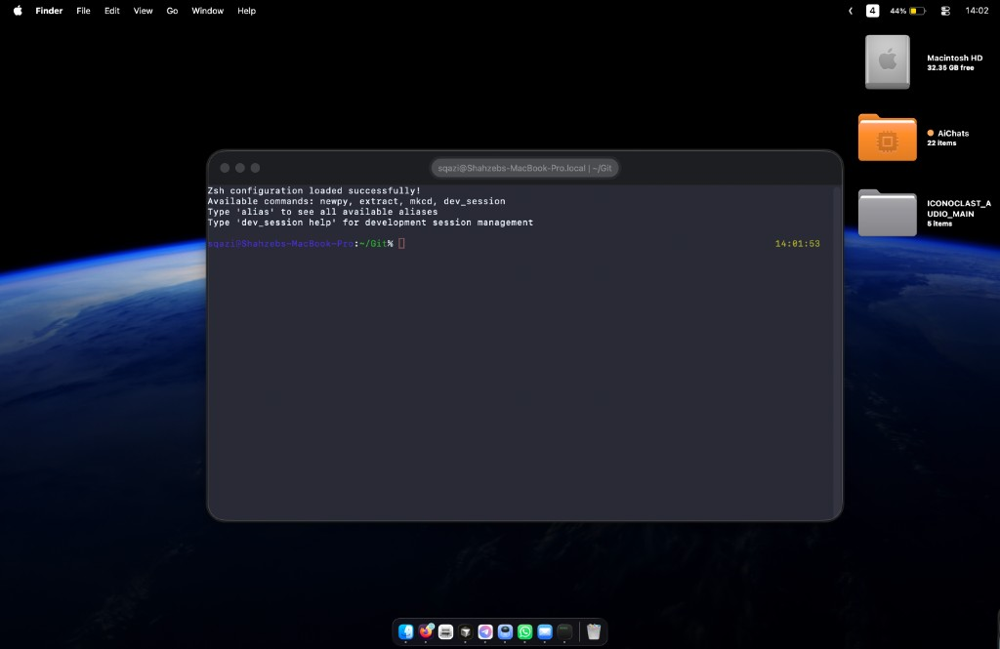
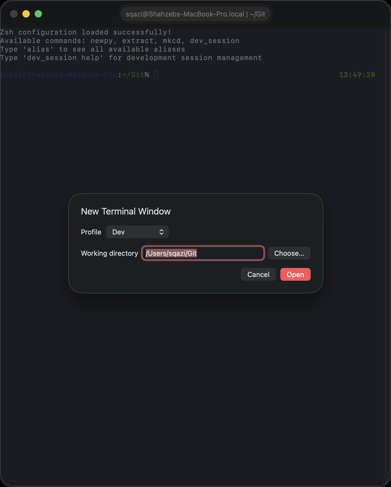

<div align="center">



<p style="color:#6e6e73;font-size:18px;margin:8px 0 18px 0;">
Profiles. Predictable XDG environments. Session semantics that match how you already work.
</p>

<p>
  <a href="https://sqazi.sh/lambda-terminal/"></a>
  <a href="https://github.com/shahzebqazi/lambda-terminal"></a>
</p>

<p>
  
  
  
  
</p>

</div>

<table width="100%" cellpadding="0" cellspacing="0" style="margin:18px 0;">
  <tr>
    <td style="background-color:#ffffff;border:1px solid #8e8e86;border-right:none;padding:16px 18px;color:#4a4a4a;">
      <strong style="color:#111111;">Status:</strong> experimental portfolio OSS — profiles, XDG env injection, project-root session semantics, and a local XDG audit tool. Useful as Swift/macOS proof for terminal tooling work. <strong>Not</strong> a production Terminal.app replacement.
    </td>
  </tr>
</table>

<p align="center">
  <a href="https://sqazi.sh/lambda-terminal/" style="display:inline-block;padding:10px 18px;border:1px solid #3f7f31;background-color:#63ba4e;color:#ffffff;text-decoration:none;font-weight:600;">Open the project site</a>
  &nbsp;
  <a href="#build--run" style="display:inline-block;padding:10px 18px;border:1px solid #404040;background-color:#d4d0c8;color:#111111;text-decoration:none;font-weight:600;">Build &amp; run</a>
</p>

<p align="center" style="color:#6e6e73;font-size:14px;">
  <a href="#website" style="color:#0066cc;text-decoration:none;">Website</a> ·
  <a href="#what-is-this" style="color:#0066cc;text-decoration:none;">What is this?</a> ·
  <a href="#features-at-a-glance" style="color:#0066cc;text-decoration:none;">Features</a> ·
  <a href="#profiles" style="color:#0066cc;text-decoration:none;">Profiles</a> ·
  <a href="#build--run" style="color:#0066cc;text-decoration:none;">Build</a> ·
  <a href="#project-structure" style="color:#0066cc;text-decoration:none;">Structure</a>
</p>


<table width="100%" cellpadding="0" cellspacing="0" style="margin:18px 0;background-color:#ece9e4;border:1px solid #8e8e86;">
  <tr>
    <td align="center" style="padding:20px 24px;font-family:Menlo,Monaco,monospace;font-size:13px;color:#111111;line-height:1.6;">
      Profiles + cwd + XDG env on launch.<br>
      One app. Deterministic session setup.<br>
      Your dotfiles stay the source of truth.
    </td>
  </tr>
</table>

## What is this?

Most terminal apps give you tabs and themes, then leave profile logic to shell config, tmux, or manual exports. λ Terminal launches shells with **profile-aware cwd**, **XDG environment injection**, and **session semantics** aligned with [dotfiles](https://github.com/shahzebqazi/dotfiles).

<table width="100%" cellpadding="0" cellspacing="1" style="margin:16px 0;background-color:#8e8e86;border:1px solid #8e8e86;">
  <tr style="background-color:#d4d0c8;">
    <th align="left" style="padding:10px 12px;color:#111111;"></th>
    <th align="left" style="padding:10px 12px;color:#111111;">Terminal.app / iTerm</th>
    <th align="left" style="padding:10px 12px;color:#111111;">λ Terminal</th>
  </tr>
  <tr style="background-color:#ffffff;">
    <td style="padding:10px 12px;color:#111111;"><strong>Profile model</strong></td>
    <td style="padding:10px 12px;color:#4a4a4a;">Manual shell config</td>
    <td style="padding:10px 12px;color:#4a4a4a;">Built-in persisted profiles</td>
  </tr>
  <tr style="background-color:#f7f7f7;">
    <td style="padding:10px 12px;color:#111111;"><strong>Project roots</strong></td>
    <td style="padding:10px 12px;color:#4a4a4a;">Remember last cwd yourself</td>
    <td style="padding:10px 12px;color:#4a4a4a;">⌘N / ⇧⌘O session picker</td>
  </tr>
  <tr style="background-color:#ffffff;">
    <td style="padding:10px 12px;color:#111111;"><strong>XDG env</strong></td>
    <td style="padding:10px 12px;color:#4a4a4a;">Inherited from login shell</td>
    <td style="padding:10px 12px;color:#4a4a4a;">Injected for <code>dev</code> / <code>ai</code></td>
  </tr>
  <tr style="background-color:#f7f7f7;">
    <td style="padding:10px 12px;color:#111111;"><strong>Audit tooling</strong></td>
    <td style="padding:10px 12px;color:#4a4a4a;">External scripts</td>
    <td style="padding:10px 12px;color:#4a4a4a;">Developer → XDG Home Audit…</td>
  </tr>
</table>

## Website

**Live site:** https://sqazi.sh/lambda-terminal/  
**GitHub Pages mirror:** https://shahzebqazi.github.io/lambda-terminal/

<table width="100%" cellpadding="0" cellspacing="0" style="margin:16px 0;border:1px solid #404040;background-color:#c0c0c0;">
  <tr>
    <td style="background-color:#d4d0c8;border-bottom:1px solid #404040;padding:6px 10px;text-align:center;font-family:Geneva,Chicago,monospace;font-size:12px;color:#111111;">
      sqazi@Shahzebs-MacBook-Pro.local | ~/Git
    </td>
  </tr>
  <tr>
    <td style="padding:0;background-color:#282a36;">
      <a href="https://sqazi.sh/lambda-terminal/"></a>
    </td>
  </tr>
</table>

<p align="center" style="color:#6e6e73;font-size:14px;">Curated snapshot from the retro Apple project page — not mockups.</p>

<table width="100%" cellpadding="0" cellspacing="0" style="margin:18px 0;">
  <tr>
    <td width="25%" align="center" style="padding:8px;"><a href="https://sqazi.sh/lambda-terminal/#screenshots"></a></td>
    <td width="25%" align="center" style="padding:8px;"><a href="https://sqazi.sh/lambda-terminal/#screenshots"></a></td>
    <td width="25%" align="center" style="padding:8px;"><a href="https://sqazi.sh/lambda-terminal/#screenshots"></a></td>
    <td width="25%" align="center" style="padding:8px;"><a href="https://sqazi.sh/lambda-terminal/#screenshots"></a></td>
  </tr>
</table>

<table width="100%" cellpadding="0" cellspacing="1" style="margin:18px 0;background-color:#8e8e86;border:1px solid #8e8e86;">
  <tr>
    <td align="center" style="padding:16px;background-color:#ffffff;"><strong style="font-size:22px;color:#111111;">4</strong><br><span style="color:#4a4a4a;font-size:12px;">profiles</span></td>
    <td align="center" style="padding:16px;background-color:#ffffff;"><strong style="font-size:22px;color:#111111;">⌘N</strong><br><span style="color:#4a4a4a;font-size:12px;">new window</span></td>
    <td align="center" style="padding:16px;background-color:#ffffff;"><strong style="font-size:22px;color:#111111;">⌘T</strong><br><span style="color:#4a4a4a;font-size:12px;">new tab</span></td>
    <td align="center" style="padding:16px;background-color:#ffffff;"><strong style="font-size:22px;color:#111111;">46</strong><br><span style="color:#4a4a4a;font-size:12px;">tests</span></td>
  </tr>
</table>

## Features at a Glance

<table width="100%" cellpadding="0" cellspacing="8">
  <tr>
    <td valign="top" width="33%" style="padding:16px;border:1px solid #8e8e86;background-color:#ffffff;">
      <strong style="color:#111111;">Four profiles</strong><br>
      <span style="color:#4a4a4a;font-size:14px;"><code>default</code>, <code>dev</code>, <code>lightweight</code>, <code>ai</code> under <code>~/.config/lambda-terminal/</code>.</span>
    </td>
    <td valign="top" width="33%" style="padding:16px;border:1px solid #8e8e86;background-color:#ffffff;">
      <strong style="color:#111111;">Project roots</strong><br>
      <span style="color:#4a4a4a;font-size:14px;">⌘N profile + cwd picker. ⇧⌘O Open in Project. Tabs inherit profile.</span>
    </td>
    <td valign="top" width="33%" style="padding:16px;border:1px solid #8e8e86;background-color:#ffffff;">
      <strong style="color:#111111;">XDG audit</strong><br>
      <span style="color:#4a4a4a;font-size:14px;">Developer → XDG Home Audit writes to <code>~/.local/state/lambda-terminal/xdg-report.md</code>.</span>
    </td>
  </tr>
</table>

## Profiles

Aligned with [dotfiles](https://github.com/shahzebqazi/dotfiles) xonsh profile names. Details: [docs/PROFILES.md](docs/PROFILES.md).

| Profile | Purpose |
| --- | --- |
| `default` | Baseline interactive shell |
| `dev` | Daily driver with XDG injection and `~/Git` cwd |
| `lightweight` | Fast startup for SSH / Pi-style sessions |
| `ai` | Cursor / agent sessions with XDG + shell context flags |

## Requirements

- macOS 14+
- Swift 5.9+
- Xcode 15+ (optional, for IDE debugging)

## Build & run

<table width="100%" cellpadding="0" cellspacing="0" style="margin:12px 0;border:1px inset #8e8e86;background-color:#1d1d1f;">
  <tr>
    <td style="padding:18px 20px;font-family:Menlo,Monaco,monospace;font-size:13px;line-height:1.55;color:#f5f5f7;white-space:pre;">git clone https://github.com/shahzebqazi/lambda-terminal.git
cd lambda-terminal
swift build
swift run LambdaTerminal

swift test
swift run xdg audit --stdout</td>
  </tr>
</table>

Open in Xcode: **File → Open** → select `Package.swift`.

Unsigned local debug builds are expected for v0.1. Code signing and notarization are not configured in CI.

## Project Structure

```
lambda-terminal/
  Sources/LambdaTerminalCore/   # profiles, env, XDG audit
  Sources/LambdaTerminal/         # SwiftUI + SwiftTerm app
  Sources/XDGAuditCLI/            # xdg audit executable
  Tests/                          # 46 tests
  docs/review/                    # GitHub Pages site (retro Apple UI)
  docs/assets/                    # README banner + rules
```

See [docs/ARCHITECTURE.md](docs/ARCHITECTURE.md), [docs/PROFILES.md](docs/PROFILES.md), [docs/ROADMAP.md](docs/ROADMAP.md).

## Design Influences

- [dotfiles](https://github.com/shahzebqazi/dotfiles) — xonsh profile model, XDG bootstrap
- [mac-config](https://github.com/shahzebqazi/mac-config) — sanitized macOS harness patterns

## Limitations

- Portfolio OSS, not shipped Apple terminal code
- Unsigned debug builds only in v0.1
- Four local profiles only; no cloud sync
- Dracula theme preset today; broader theme system is future work


<div align="center" style="color:#6e6e73;font-size:13px;padding:12px 0 24px 0;">
  <strong style="color:#1d1d1f;">MIT License</strong> ·
  <a href="https://github.com/shahzebqazi" style="color:#0066cc;text-decoration:none;">@shahzebqazi</a> ·
  <a href="https://sqazi.sh" style="color:#0066cc;text-decoration:none;">sqazi.sh</a> ·
  <a href="mailto:code@sqazi.sh" style="color:#0066cc;text-decoration:none;">code@sqazi.sh</a>
</div>
