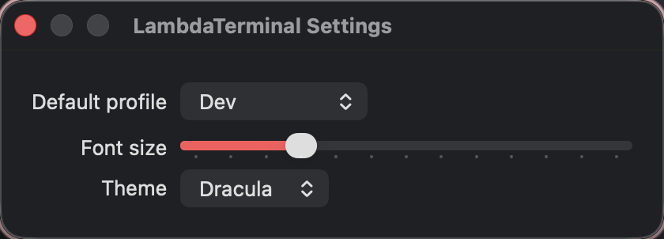

# λ Terminal

**v0.1 — experimental portfolio project, not a production Terminal.app replacement.**

λ Terminal is a macOS terminal that optimizes **developer-workflow UX**: **profiles**, **predictable XDG environments**, and **session semantics** (project roots, agent sessions) instead of yet another config format. Terminal power-users already carry dotfiles, XDG layouts, and per-project cwd habits — this app launches shells that match those conventions on day one.

> Terminal power-users don't need another config format; they need **profiles**, **predictable environments**, and **session semantics** that match how they already work.

## Website

**Live site:** https://shahzebqazi.github.io/lambda-terminal/

Retro Apple–inspired project page: hero, feature grid, screenshot gallery, build steps, and doc links. Source lives in [`docs/review/`](docs/review/).

[](https://shahzebqazi.github.io/lambda-terminal/)

Local preview after clone:

```bash
cd lambda-terminal
python3 -m http.server 8766 --directory .
open http://127.0.0.1:8766/docs/review/
```

## Screenshots

Full gallery on the [live site](https://shahzebqazi.github.io/lambda-terminal/#screenshots). Quick look:

| Main session | Menu bar & menus | Desktop context |
| --- | --- | --- |
| [](https://shahzebqazi.github.io/lambda-terminal/#screenshots) | [](https://shahzebqazi.github.io/lambda-terminal/#screenshots) | [](https://shahzebqazi.github.io/lambda-terminal/#screenshots) |

| New window sheet | Settings |
| --- | --- |
| [](https://shahzebqazi.github.io/lambda-terminal/#screenshots) | [](https://shahzebqazi.github.io/lambda-terminal/#screenshots) |

## Features (v0.1)

- **Four profiles:** `default`, `dev`, `lightweight`, `ai` (persisted under `~/.config/lambda-terminal/`)
- **⌘N** new window with profile + cwd picker (remembers last cwd per profile)
- **⌘T** new tab inheriting profile; **⇧⌘O** Open in Project…
- **XDG env injection** for `dev` / `ai` profiles
- **Developer → XDG Home Audit…** (Markdown report to `~/.local/state/lambda-terminal/xdg-report.md`)
- **Settings:** default profile, font size, Dracula theme preset

## Design influences

- [dotfiles](https://github.com/shahzebqazi/dotfiles) — xonsh profile model, XDG bootstrap
- [mac-config](https://github.com/shahzebqazi/mac-config) — sanitized macOS harness patterns

## Requirements

- macOS 14+
- Swift 5.9+
- Xcode 15+ (optional, for IDE debugging)

## Build & run

```bash
git clone https://github.com/shahzebqazi/lambda-terminal.git
cd lambda-terminal
swift build
swift run LambdaTerminal
```

Run tests:

```bash
swift test
```

XDG audit CLI:

```bash
swift run xdg audit --stdout
swift run xdg check
```

Open in Xcode: **File → Open** → select `Package.swift`.

Unsigned local debug builds are expected for v0.1. Code signing and notarization are not configured in CI.

## Project layout

```
Sources/LambdaTerminalCore/   # profiles, env, XDG audit
Sources/LambdaTerminal/         # SwiftUI + SwiftTerm app
Sources/XDGAuditCLI/            # xdg audit executable
Tests/LambdaTerminalCoreTests/
Tools/xdg/                      # wrapper scripts
docs/
```

See [docs/ARCHITECTURE.md](docs/ARCHITECTURE.md), [docs/PROFILES.md](docs/PROFILES.md), [docs/ROADMAP.md](docs/ROADMAP.md).

## Contact & license

- **Author:** [shahzebqazi](https://github.com/shahzebqazi)
- **Contact:** code@sqazi.sh · [sqazi.sh](https://sqazi.sh)
- **License:** [MIT](LICENSE)
