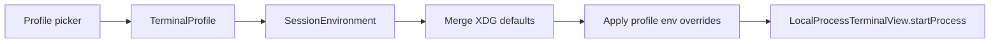

# Architecture

Lambda Terminal v0.1 is a Swift Package with three deliverables:

| Target | Role |
|--------|------|
| `LambdaTerminalCore` | Profiles, settings persistence, session env merge, XDG audit engine |
| `LambdaTerminal` | macOS SwiftUI host + SwiftTerm `LocalProcessTerminalView` |
| `xdg` | CLI for home-directory XDG compliance (`audit`, `check`) |

## Session launch flow

1. User picks a **profile** (`default`, `dev`, `lightweight`, `ai`) and optional **working directory**.
2. `SessionEnvironment` merges inherited process env, optional XDG injection, then profile-specific keys (profile wins).
3. SwiftTerm spawns `$SHELL` (or profile override) with `-l` in the chosen directory.

Persistence (XDG):

- `~/.config/lambda-terminal/profiles.json`
- `~/.config/lambda-terminal/settings.json`
- `~/.local/state/lambda-terminal/xdg-report.md` (audit output)

## Design influences

Profile semantics mirror the public [dotfiles](https://github.com/shahzebqazi/dotfiles) xonsh profile model (`default`, `dev`, `lightweight`, `ai`) and device→profile mapping from a private dotfiles monorepo — sanitized for this public repo.

Window/tab UX follows the **fixed project root** pattern used with Ghostty via Leader Key: new windows remember last cwd per profile; **Open in Project…** sets cwd explicitly.

## Non-goals (v0.1)

- Custom VT parser (SwiftTerm handles rendering)
- Code signing / notarization in CI
- Network, telemetry, or config import

## Testing

Pure logic (classifier, env merge, JSON codecs) lives in `LambdaTerminalCore` and is covered by `LambdaTerminalCoreTests`. GUI flows are manual for v0.1.
